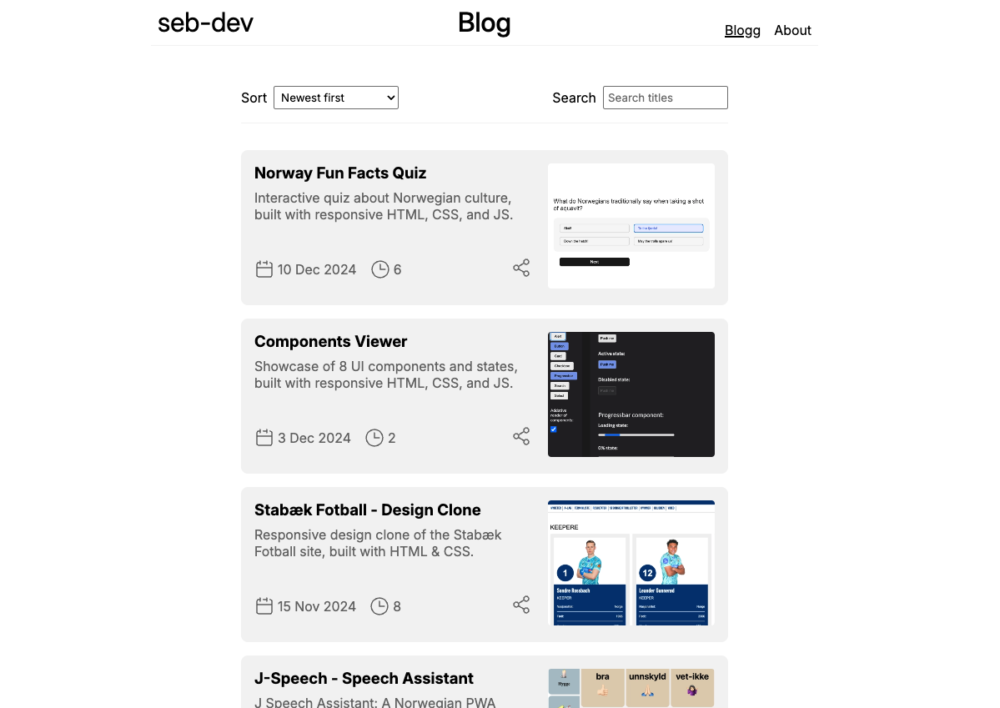

# Personal Blog

This project is a personal blog for showcasing my web development work. The website serves as an online portfolio, highlighting projects, thoughts on web development, and technical insights.

**Published website:** [Visit My Blog](https://sbraende-blog.netlify.app/)



## Features

- Sort and Filter: Easily find relevant blog posts.
- Responsive Design: Optimized for desktop and mobile viewing.
- Built with Vanilla Web Technologies: No external frameworks—just HTML, CSS, and JavaScript.
- Vite-Powered Development: Fast and modern build tooling.

## Installation

1. Clone the repository:

```bash
git clone https://github.com/sbraende/blog
```

2. Navigate into the source directory:

```bash
cd blog
```

3. Install dependencies.

```bash
npm install
```

3. Run local server.

```bash
npm run dev
```

## License

This project is licensed under the MIT License. Feel free to use, modify, and distribute it under the license terms.
